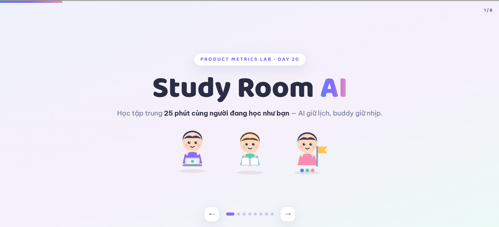
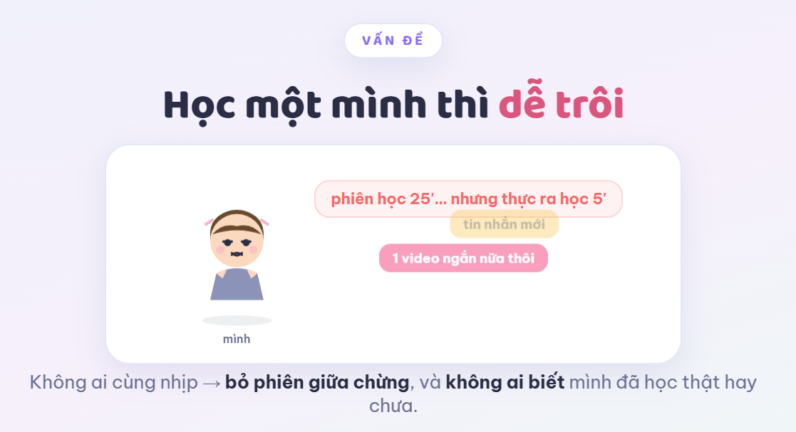
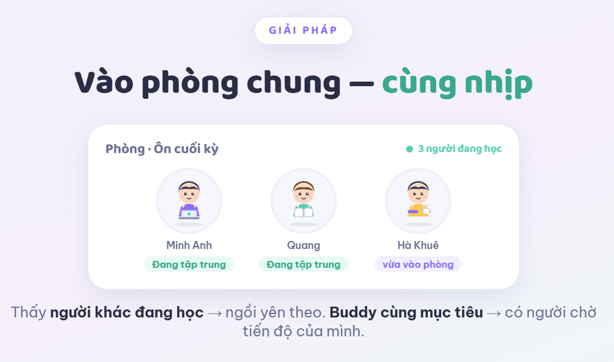

# Track1 Day 20 — Metrics Pack

- **Họ tên:** Nguyễn Hà Khuê
- **MHV:** `2A202602938`
- **Dự án chọn làm:** Study Room AI — phòng học chung ảo cho sinh viên: phiên pomodoro 25 phút cùng những người đang học cùng mục tiêu; AI gợi ý khung giờ hợp lịch, ghép buddy cùng mục tiêu thi, tổng hợp tiến bộ cuối tuần.

**Khởi đầu:** học tập trung 25 phút cùng người đang học như bạn, AI giữ lịch, buddy giữ nhịp.

**Vấn đề — học một mình dễ trôi:** phiên 25' nhưng thực ra học 5' vì xao nhãng (tin nhắn, video ngắn) — không ai cùng nhịp và không ai biết mình học thật hay chưa.

**Giải pháp — phòng chung có peer:** thấy "3 người đang học" trong phòng, có người "vừa vào phòng" — social proof giữ ngồi yên; buddy cùng mục tiêu chờ tiến độ của mình.

---

## 00 — Dự án, persona, core job

| | |
|---|---|
| **Dự án** | Study Room AI — phòng học chung ảo, phiên pomodoro 25/5 có peer; AI gợi ý khung giờ, ghép buddy, tổng hợp tiến bộ |
| **Persona** | Sinh viên năm cuối / học sinh ôn thi, có thời khóa biểu cố định, học một mình dễ mất tập trung, quen học nhóm |
| **Core job** | Giữ được các buổi học tập trung đều đặn — học một mình dễ bỏ phiên giữa chừng mà không ai biết |
| **Phạm vi** | Use case chính: phiên học pomodoro có peer trong phòng chung. Không phân tích use case tổng hợp báo cáo tuần |

## 01 — Core Action Card

| Thành phần | Câu trả lời |
|---|---|
| Target user | Sinh viên có mục tiêu học đang chạy (thi cuối kỳ, chứng chỉ, học phần) |
| Core job | Giữ nhịp học tập trung đều đặn, không trôi khi học một mình |
| **Core action** | **Vào phòng chung, hoàn thành đủ 25 phút pomodoro tập trung** |
| Object | Một phiên pomodoro trong phòng có ≥1 người khác đang học |
| Preconditions | Đã tạo mục tiêu học (môn/chứng chỉ) và có phòng phiên mở đúng khung giờ |
| Completion rule | Bộ đếm 25' chạy đủ trên server, không rời phiên >90 giây — thoát sớm không tính |
| Core value | 25 phút học thật sự tập trung, có người cùng nhịp |
| Evidence of value | `focus_session_completed` được ghi với đủ thời lượng; streak hiển thị cho user và buddy |
| Core value event | `focus_session_completed` |

**Tự kiểm 5 tiêu chí — 5/5 PASS:** gần core value (phiên hoàn thành = 25' học thật) · lặp lại (khung giờ học lặp hằng ngày) · quan sát được (bộ đếm server) · có ý nghĩa (nhiều phiên hoàn thành ≈ học tập trung hơn) · tác động được (gợi ý giờ, ghép buddy, social proof).

Không phải "mở app" hay "hỏi AI": đó là thao tác giao diện / output hệ thống — xảy ra cả khi user không học; phiên hoàn thành mới chứng minh giá trị.

## 02 — Action Nature Card + cadence

| Thành phần | Câu trả lời |
|---|---|
| Actor | Sinh viên (cá nhân); giá trị sinh mạnh khi có người học cùng phòng |
| Intent | Nhu cầu có sẵn: đến giờ học, muốn giữ tập trung thay vì học một mình |
| Trigger | Khung giờ học có sẵn trong đời user (thời khóa biểu, kế hoạch ôn thi) — natural trigger; AI gợi ý giờ là nurture |
| Effort | Thao tác thấp (1 tap); effort thật nằm ở 25 phút tập trung |
| Value timing | Tức thời sau mỗi phiên; tích lũy theo tuần (streak, tiến bộ) |
| State | Lịch sử phiên + streak lưu vĩnh viễn; lịch dày giúp AI gợi ý chính xác hơn |
| Dependency | Lịch học của user; phòng có thể do chính user mở — không phụ thuộc người khác để bắt đầu |
| Repeat condition | Thời khóa biểu tiếp tục đến giờ học mỗi ngày — lý do quay lại tồn tại kể cả không có notification |

**Kết luận cadence:** Đối với *sinh viên có thời khóa biểu và kỳ thi đang tới*, core action *hoàn thành phiên pomodoro* thường xuất hiện *1–4 lần mỗi ngày vào khung giờ học* vì *nhu cầu học tập trung sinh ra từ lịch học và kế hoạch ôn thi — khung giờ học lặp mỗi ngày bất kể app có nhắc hay không*. Do đó, nhịp đo phù hợp là **daily (ngày có phiên hoàn thành)** ở cấp **user cá nhân**, tổng hợp tuần cho quyết định sản phẩm.

*Cân nhắc:* 6 phiên/ngày có thể là dấu hiệu cày quá sức hoặc cắm máy cho có — tín hiệu tốt là đủ phiên theo kế hoạch và tỉ lệ bỏ dở thấp, nên NSM đặt quality threshold vào phiên hoàn thành thật.

## 03 — Metric System

**Activation**
- Start event: `study_goal_created` — tạo thành công mục tiêu học đầu tiên (không dùng tour hướng dẫn hay đăng nhập)
- Activation event: `focus_session_completed` lần đầu tiên
- Time window: **72 giờ** kể từ khi tạo mục tiêu (đủ trôi qua ít nhất một khung giờ học kế tiếp; 24h quá ngắn vì nhiều user tạo mục tiêu buổi tối)

**Engagement**
- Frequency: số ngày có ≥1 phiên hoàn thành / số ngày trong tuần
- Depth: số phút tập trung có peer / ngày; tỉ lệ phiên hoàn thành / phiên đã bật

**North Star Metric** = unit of value + quality threshold + frequency:
- Unit: **1 phiên pomodoro hoàn thành (25 phút tập trung thật)**
- Quality: chạy đủ 25' trên server, không rời >90s, có ≥1 peer học cùng ít nhất một phần phiên; phiên "cắm máy cho có" bị loại
- Frequency: **số phiên hoàn thành / user / tuần**

→ **NSM: "Completed focus sessions with peers per active user per week".** Không phải DAU — DAU đếm mở app, không chứng minh 25 phút học thật.

**Leading indicators (3)**
1. Phiên đầu tiên hoàn thành trong phòng có ≥2 người — user đã nếm đúng value "học cùng nhịp" ngay lần đầu → xác suất quay lại cao hơn hẳn
2. Có buddy ghép cặp trong 3 ngày đầu — buddy là "người chờ", lý do quay lại ngoài notification
3. Streak ngày trong tuần đầu (số ngày liên tiếp có phiên) — đã đầu tư duy trì chuỗi 3+ ngày thì phải có lý do mạnh lắm mới phá

**Counter-metrics**
1. Tỉ lệ phiên "cắm máy cho có": đủ 25' nhưng không có hoạt động học nào (không note, không camera/mic, rời máy >80% thời gian) — NSM có thể bị game bằng bật phiên rồi bỏ máy
2. Tỉ lệ phiên bị hủy giữa chừng — nếu NSM tăng nhờ đẩy user vào phòng nhiều hơn nhưng thoát giữa chừng cũng tăng, trải nghiệm đang xấu đi

## 04 — Retention Definition (6 thành phần)

| Thành phần | Định nghĩa |
|---|---|
| Unit | User cá nhân (sinh viên) — phiên học là hành vi của một người |
| Cohort entry | `study_goal_created` — tuần tạo mục tiêu học đầu tiên |
| Return event | `focus_session_completed` (đủ quality threshold ở mục 03) |
| Window | **W1, W2, W4** kể từ tuần cohort entry — cadence daily nhưng "giữ nhịp học" là sự duy trì, đo theo tuần để một ngày nghỉ không méo kết luận |
| Threshold | **≥3 ngày có ≥1 phiên hoàn thành trong window** — khớp nhịp học thực tế của sinh viên |
| Segment | Mục tiêu học active + kỳ thi/chứng chỉ ≤30 ngày; phân thêm có buddy vs không, phiên có peer vs một mình |

**Bản đầy đủ:** "W4 retention của cohort = % user có ≥3 ngày có ≥1 phiên hoàn thành trong tuần thứ 4 kể từ tuần tạo mục tiêu, tính trong segment mục tiêu active có kỳ thi ≤30 ngày." So mốc: natural cycle = khung giờ học hàng ngày; cohort cùng segment; benchmark nhóm app focus/học nhóm (W4 thường rất thấp — có peer thật kỳ vọng cao hơn).

Khớp cadence: hành vi daily theo khung giờ học → đo ngày-có-phiên trong tuần, không dùng D30/MAU, không ép hourly.

## 05 — Product Loop (2 chu kỳ + hypothesis)

**Chu kỳ 1 — daily:** Natural trigger (đến khung giờ học theo thời khóa biểu) → core action (hoàn thành phiên pomodoro) → immediate value (25 phút học thật, cùng nhịp) → saved state (streak + tiến độ lưu lại, buddy thấy).

**Chu kỳ 2 — weekly:** Natural trigger (tuần học mới, buddy và phòng quen vẫn hoạt động) → core action (phiên tuần mới hoàn thành, giờ hợp hơn) → immediate value (AI gợi ý giờ chính xác hơn, gặp lại buddy) → saved state (streak tuần, tổng hợp tiến bộ) → trigger tiếp theo quay về chu kỳ 1.

**Metric hypothesis:** Nếu loop này hoạt động, metric **W2 retention (≥3 ngày có phiên/tuần)** và **NSM (phiên hoàn thành / user / tuần)** sẽ tăng trong **4 tuần đầu sau cohort entry**, vì giờ học là natural trigger lặp lại hằng ngày và buddy + người trong phòng tạo trách nhiệm xã hội — giữ user quay lại **kể cả khi tắt notification**.

*Loại trừ external trigger:* tắt notification 3 ngày vẫn còn — (1) khung giờ học vẫn đến, (2) buddy vẫn thấy mình chưa học và ngược lại, (3) streak hiển thị khi user tự mở app. Reason to return tồn tại từ bên trong → notification chỉ khuếch đại nature.

## 06 — Tracking nhanh (8 events + acceptance criteria)

| Event | Ý nghĩa (điều đã xảy ra) | Thời điểm ghi nhận | Metric sử dụng |
|---|---|---|---|
| `study_goal_created` | Mục tiêu học đầu tiên được lưu | Backend xác nhận tạo thành công — không bắn khi nhập dở | Activation start · Cohort entry (04) |
| `focus_session_completed` | Phiên chạy đủ 25', không hủy | Bộ đếm server chạm 25' và phiên không bị hủy — không bắn lúc bấm "bắt đầu" | Activation event · NSM · Engagement · Return event (04) |
| `focus_session_abandoned` | Phiên bị hủy/thoát trước 25' | Server ghi nhận rời >90s hoặc chủ động thoát | Depth (denominator) · Counter 2 |
| `session_flagged_idling` | Phiên đủ 25' bị đánh dấu "cắm máy cho có" | Rule hành vi chạy xong khi phiên kết thúc | Counter 1 (loại khỏi NSM) |
| `buddy_paired` | Ghép buddy cùng mục tiêu, cả hai xác nhận | Cả hai bên xác nhận ghép cặp | Leading 2 · Loop chu kỳ 2 |
| `room_joined_with_peers` | Vào phòng đang có ≥1 người khác học | Trạng thái phòng xác nhận user vào khi có peer | Leading 1 |
| `weekly_progress_viewed` | Mở tổng hợp tiến bộ tuần | Báo cáo tuần load hoàn tất | Loop chu kỳ 2 |
| `ai_schedule_suggestion_accepted` | Chấp nhận khung giờ AI gợi ý vào lịch | Khung giờ được ghi vào lịch user | Leading 1 (gián tiếp) · Nurture |

**Acceptance criteria:**
1. Với mỗi cặp `user_id + session_id`, hệ thống chỉ ghi `focus_session_completed` đúng một lần khi bộ đếm 25' chạy đủ và phiên không bị hủy. Reload / mất mạng vào lại / retry không tạo thêm event cho cùng phiên; thoát giữa chừng chỉ sinh `focus_session_abandoned`.
2. Event chỉ bắn khi hành vi đã hoàn tất: `study_goal_created` chỉ được bắn sau khi backend xác nhận ghi thành công; lần bấm "Lưu" lỗi validation không tạo event nào. `focus_session_completed` không được bắn ở thời điểm bấm "bắt đầu phiên".
